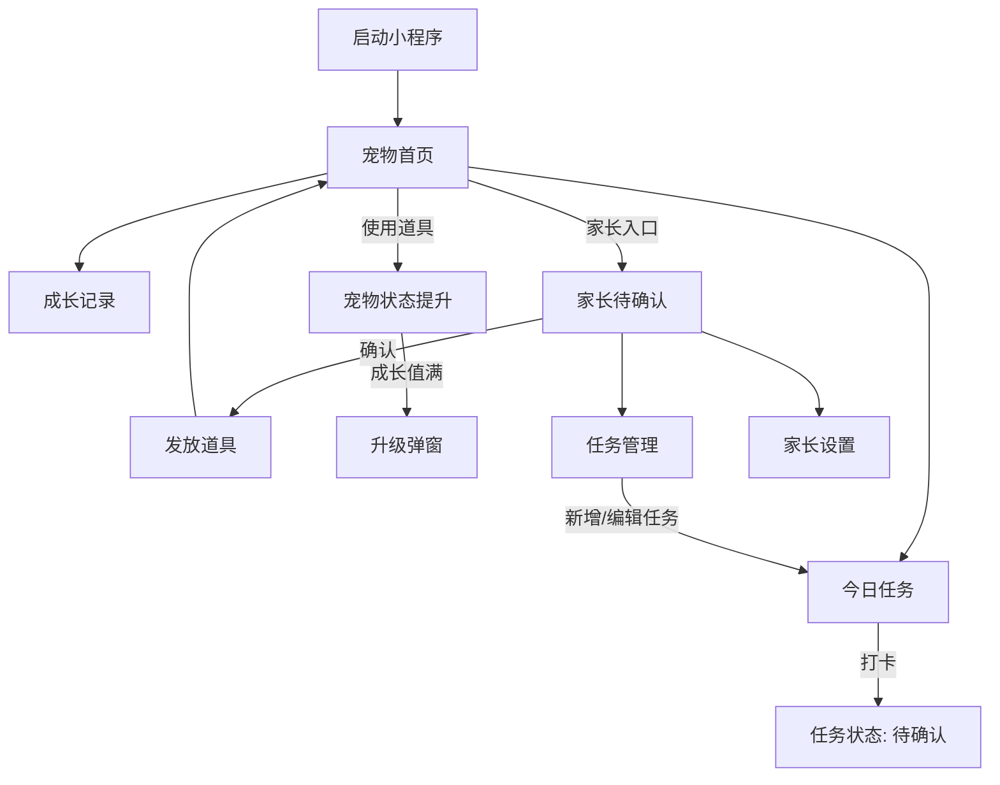

# 萌宠打卡小程序 — 页面结构

| 项目 | 内容 |
|------|------|
| 技术栈 | UniApp + 微信小程序 |
| 版本 | MVP v1.0 |
| 文档日期 | 2026-06-08 |

---

## 1. 页面总览

```
萌宠打卡小程序
├── 启动与引导
│   └── pages/onboarding/index          首次引导（可选，MVP 可简化为一页欢迎）
├── 主 Tab 栏（孩子模式）
│   ├── pages/home/index                宠物首页 ⭐
│   ├── pages/tasks/index               今日任务 ⭐
│   └── pages/record/index              成长记录 ⭐
├── 家长模式
│   ├── pages/parent/confirm/index      待确认列表 ⭐
│   ├── pages/parent/tasks/index        任务管理 ⭐
│   └── pages/parent/settings/index     家长设置
└── 公共
    ├── pages/role-switch/index         角色切换（可合并到设置页）
    └── pages/pet/upgrade/index         升级弹层（建议用组件而非独立页）
```

> ⭐ 表示 MVP 必做页面

---

## 2. 导航结构

### 2.1 孩子模式 — 底部 TabBar

| Tab | 页面 | 图标建议 | 说明 |
|-----|------|----------|------|
| 萌宠 | `pages/home/index` | 宠物头像 | 宠物状态与养成操作 |
| 任务 | `pages/tasks/index` | 清单/勾选 | 今日任务与打卡 |
| 记录 | `pages/record/index` | 日历/星星 | 连续天数与历史 |

### 2.2 家长模式 — 无 TabBar，栈式导航

从孩子模式首页右上角「家长入口」进入，或在角色切换页选择「家长模式」。

| 页面 | 路由 | 入口 |
|------|------|------|
| 待确认 | `pages/parent/confirm/index` | 家长首页 / 角标提示 |
| 任务管理 | `pages/parent/tasks/index` | 家长首页菜单 |
| 家长设置 | `pages/parent/settings/index` | 家长首页菜单 |

---

## 3. 页面详细说明

### 3.1 宠物首页 `pages/home/index`

**用途：** 孩子主界面，展示宠物并进行养成操作。

**布局结构：**

```
┌─────────────────────────────┐
│  [家长入口]     萌宠打卡      │  ← 自定义导航栏
├─────────────────────────────┤
│                             │
│      [宠物形象大图]          │
│         小萌  Lv.2          │
│    ████████░░ 成长值 35/50   │
│                             │
├─────────────────────────────┤
│  🍖饥饿  ████░░  80          │
│  🧼清洁  ███░░░  60          │
│  🎾心情  █████░  90          │
├─────────────────────────────┤
│  背包: 食物×3  肥皂×2  玩具×1 │
├─────────────────────────────┤
│ [喂食]    [洗澡]    [陪玩]   │  ← 大按钮横排
└─────────────────────────────┘
│  萌宠  │  任务  │  记录     │  ← TabBar
└─────────────────────────────┘
```

**组件：**

- `PetAvatar` — 宠物形象与等级
- `StatusBar` — 单项状态进度条
- `InventoryBar` — 道具背包摘要
- `ActionButton` — 养成操作按钮

**跳转：**

- 点击「家长入口」→ `pages/role-switch/index` 或直接进入家长待确认页

---

### 3.2 今日任务 `pages/tasks/index`

**用途：** 展示当日任务，孩子打卡。

**布局结构：**

```
┌─────────────────────────────┐
│         今日任务              │
│      6月8日 星期日           │
├─────────────────────────────┤
│ ┌─────────────────────────┐ │
│ │ 🪥 刷牙                  │ │
│ │ 奖励: 肥皂 ×1            │ │
│ │         [  打 卡  ]      │ │  ← 未完成
│ └─────────────────────────┘ │
│ ┌─────────────────────────┐ │
│ │ 📖 阅读 15 分钟          │ │
│ │ 奖励: 食物 ×1            │ │
│ │      ⏳ 等待家长确认      │ │  ← 待确认
│ └─────────────────────────┘ │
│ ┌─────────────────────────┐ │
│ │ 🧸 收拾玩具              │ │
│ │ 奖励: 玩具 ×1            │ │
│ │      ✅ 已完成           │ │  ← 已完成
│ └─────────────────────────┘ │
├─────────────────────────────┤
│  今日进度: 1/3 已完成        │
└─────────────────────────────┘
```

**组件：**

- `TaskCard` — 单条任务卡片
- `TaskProgress` — 当日完成进度

**状态与按钮映射：**

| 状态 | 按钮/展示 |
|------|-----------|
| 未完成 | 显示「打卡」按钮 |
| 待确认 | 灰色文案「等待家长确认」 |
| 已完成 | 显示「已完成」勾选 |

---

### 3.3 成长记录 `pages/record/index`

**用途：** 展示连续打卡与历史完成情况。

**布局结构：**

```
┌─────────────────────────────┐
│         成长记录              │
├─────────────────────────────┤
│  ┌──────┐  ┌──────┐         │
│  │  7   │  │ Lv.2 │         │
│  │连续天 │  │宠物等级│        │
│  └──────┘  └──────┘         │
│  ┌──────┐                   │
│  │  23  │                   │
│  │累计完成│                   │
│  └──────┘                   │
├─────────────────────────────┤
│  近 7 日                    │
│  一 二 三 四 五 六 日        │
│  ✓  ✓  ✓  ·  ·  ·  ·      │
├─────────────────────────────┤
│  最近完成                   │
│  · 6/8 刷牙 ✅              │
│  · 6/7 阅读 ✅              │
│  · 6/7 运动 ✅              │
└─────────────────────────────┘
```

**组件：**

- `StatCard` — 统计数字卡片
- `WeekCalendar` — 近 7 日完成标记
- `HistoryList` — 最近完成列表

---

### 3.4 家长待确认 `pages/parent/confirm/index`

**用途：** 家长审核孩子打卡记录。

**布局结构：**

```
┌─────────────────────────────┐
│  ← 返回      待确认 (2)       │
├─────────────────────────────┤
│ ┌─────────────────────────┐ │
│ │ 刷牙                     │ │
│ │ 打卡时间: 今天 08:30     │ │
│ │ [驳回]        [确认通过] │ │
│ └─────────────────────────┘ │
│ ┌─────────────────────────┐ │
│ │ 阅读 15 分钟             │ │
│ │ 打卡时间: 今天 19:00     │ │
│ │ [驳回]        [确认通过] │ │
│ └─────────────────────────┘ │
├─────────────────────────────┤
│  暂无待确认时显示空状态插画   │
└─────────────────────────────┘
```

**交互：**

- 「确认通过」→ 发放奖励、更新任务状态、刷新列表
- 「驳回」→ 任务回退未完成（可选二次确认）

---

### 3.5 家长任务管理 `pages/parent/tasks/index`

**用途：** 新增、编辑、开关每日任务。

**布局结构：**

```
┌─────────────────────────────┐
│  ← 返回      任务管理  [+新增]│
├─────────────────────────────┤
│  快捷添加                    │
│  [刷牙][阅读][运动][练字]... │
├─────────────────────────────┤
│ ┌─────────────────────────┐ │
│ │ 🪥 刷牙        [开启]   │ │
│ │ 奖励: 肥皂×1    [编辑]  │ │
│ └─────────────────────────┘ │
│ ┌─────────────────────────┐ │
│ │ 📖 阅读        [关闭]   │ │
│ │ 奖励: 食物×1    [编辑]  │ │
│ └─────────────────────────┘ │
└─────────────────────────────┘
```

**子页面 / 弹窗：**

- `TaskFormModal` — 新增/编辑任务表单（建议弹窗，减少页面跳转）

**表单字段：**

- 任务名称（必填）
- 图标（预设选择）
- 奖励类型（食物/肥皂/玩具）
- 奖励数量（1~3）
- 是否启用

---

### 3.6 家长设置 `pages/parent/settings/index`

**用途：** 宠物名称、角色切换等基础配置。

**内容：**

- 宠物名称编辑
- 切换为孩子模式
- 关于 / 版本信息

---

### 3.7 角色切换 `pages/role-switch/index`（可选独立页）

**用途：** 在孩子与家长模式间切换。

**交互：**

- 选择「我是家长」→ 简单确认弹窗 → 进入家长待确认页
- 选择「我是小朋友」→ 返回孩子 Tab 首页

> MVP 可将此功能合并到首页「家长入口」弹窗，减少一个页面。

---

## 4. 全局组件

| 组件名 | 路径建议 | 用途 |
|--------|----------|------|
| `NavBar` | `components/NavBar/` | 自定义导航栏 |
| `TabBar` | 使用 `pages.json` 配置 | 底部导航 |
| `EmptyState` | `components/EmptyState/` | 空列表占位 |
| `RewardToast` | `components/RewardToast/` | 获得道具提示 |
| `UpgradeModal` | `components/UpgradeModal/` | 升级祝贺弹窗 |
| `ConfirmDialog` | `components/ConfirmDialog/` | 家长操作确认 |
| `RoleBadge` | `components/RoleBadge/` | 当前模式标识 |

---

## 5. pages.json 路由配置草案

```json
{
  "pages": [
    { "path": "pages/home/index", "style": { "navigationStyle": "custom" } },
    { "path": "pages/tasks/index", "style": { "navigationBarTitleText": "今日任务" } },
    { "path": "pages/record/index", "style": { "navigationBarTitleText": "成长记录" } },
    { "path": "pages/parent/confirm/index", "style": { "navigationBarTitleText": "待确认" } },
    { "path": "pages/parent/tasks/index", "style": { "navigationBarTitleText": "任务管理" } },
    { "path": "pages/parent/settings/index", "style": { "navigationBarTitleText": "设置" } }
  ],
  "tabBar": {
    "color": "#999999",
    "selectedColor": "#FF8C42",
    "backgroundColor": "#FFFFFF",
    "list": [
      { "pagePath": "pages/home/index", "text": "萌宠", "iconPath": "static/tab/pet.png", "selectedIconPath": "static/tab/pet-active.png" },
      { "pagePath": "pages/tasks/index", "text": "任务", "iconPath": "static/tab/task.png", "selectedIconPath": "static/tab/task-active.png" },
      { "pagePath": "pages/record/index", "text": "记录", "iconPath": "static/tab/record.png", "selectedIconPath": "static/tab/record-active.png" }
    ]
  }
}
```

---

## 6. 页面流转图



---

## 7. 设计规范摘要

| 项目 | 规范 |
|------|------|
| 主色 | `#FF8C42`（暖橙，活泼） |
| 辅色 | `#4ECDC4`（薄荷绿，完成态） |
| 背景 | `#FFF8F0`（浅暖白） |
| 圆角 | 卡片 24rpx，按钮 44rpx |
| 主字号 | 标题 36rpx，正文 28rpx，辅助 24rpx |
| 点击区域 | 最小 88rpx × 88rpx |

---

## 8. MVP 页面优先级

| 优先级 | 页面 | 说明 |
|--------|------|------|
| P0 | 宠物首页 | 闭环核心 |
| P0 | 今日任务 | 打卡入口 |
| P0 | 家长待确认 | 闭环必要环节 |
| P0 | 家长任务管理 | 任务数据来源 |
| P1 | 成长记录 | 正向反馈 |
| P1 | 家长设置 | 宠物名称等 |
| P2 | 角色切换独立页 | 可合并为弹窗 |
| P2 | 首次引导 | 可后续补充 |
